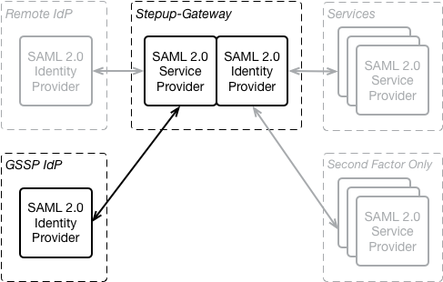

# Generic SAML Stepup Provider (GSSP)

.

OpenConext Stepup offers a generic SAML 2.0 WEB-SSO based method to add new providers of stepup mechanisms in a way that requires minimal changes in the Stepup-Gateway, the Stepup-RA and the Stepup-SelfService. Such a Generic SAML Stepup Provider (GSSP) behaves as an SAML IdP towards the Stepup-Gateway. Currently a "biometric" GSSP can be configured in addition to the "tiqr" GSSP. To add more GSSPs some coding is required in the Stepup applications, but it would certainly be feasible to implement a way to add new GSSPs to Stepup though configuration only.

The GSSP interface in the Stepup-Gateway allows both the authentication of users and the enrolment of new users for a step-up method to be delegated to a separate component that functions as part of the step up authentication service. This allows new step-up methods to be changed or added to the Stepup service without having to change any of the existing components. Any web based authentication method can be added to Stepup in this way.

To turn an authentication method (i.e. tiqr, biometric, ...) into an GSSP it must implement a SAML 2.0 Identity Provider (IdP) interface. Each authentication method becomes a different GSSP in the Stepup-Gateway. The EnityID of a GSSP is `https://gateway.tld/gssp/<method>/metadata`, which is also the metadata URL. The metadata contains an IDPSSODescriptor and an SPSSODescriptor. The IDPSSODescriptor is the endpoint that used by the Stepup-Selfservice and Stepup-RA during enrollment and authentication. The SPSSODescriptor is for the GSSP. Note that the SPSSODescriptor currently only contains the most basic information and lacks the SAML signing certificate, this must be configured in the GSSP IdP by hand.

## Enrollment

When a user needs to enroll for a new token the Stepup-Gateway sends a normal SAML 2.0 AuthnRequest to the GSSP IdP. This is a standard AuthnRequest:
- HTTP-Redirect binding
- Signed with `http://www.w3.org/2001/04/xmldsig-more#rsa-sha256`
- The Issuer is `https://gateway.tld/gssp/<method>/metadata` where <method> identifies the stepup provider. Currently "tiqr" and "biometric" are available.

When the GSSP IdP receives an enrollment request it should assign a unique identifier to the token, and return that token identifier in the Subject NameID in the Assertion back to the GSSP.

### Example messages

Example GSSP Enrollment Request to the "tiqr" GSSP IdP:
```xml
<samlp:AuthnRequest xmlns:samlp="urn:oasis:names:tc:SAML:2.0:protocol"
                    xmlns:saml="urn:oasis:names:tc:SAML:2.0:assertion"
                    ID="_92dbb2d48fa7962f3523ea301e85ec5dc52b2d09d9affc84e9b8163c843f"
                    Version="2.0"
                    IssueInstant="2017-04-18T07:46:45Z"
                    Destination="https://tiqr.tld/saml/sso"
                    AssertionConsumerServiceURL="https://gateway.tld/gssp/tiqr/consume-assertion"
                    ProtocolBinding="urn:oasis:names:tc:SAML:2.0:bindings:HTTP-POST">
    <saml:Issuer>https://gateway.tld/gssp/tiqr/metadata</saml:Issuer>
    <samlp:Scoping ProxyCount="10">
        <samlp:RequesterID>https://selfservice.tld/registration/gssf/tiqr/metadata</samlp:RequesterID>
    </samlp:Scoping>
</samlp:AuthnRequest>

```

Example Response from the "tiqr" GSSP IdP to the Stepup-Gateway:
```xml
<samlp:Response xmlns:samlp="urn:oasis:names:tc:SAML:2.0:protocol"
                xmlns:saml="urn:oasis:names:tc:SAML:2.0:assertion"
                ID="_041e942e26116eccd66fb4821422984ac586ab4c16"
                Version="2.0"
                IssueInstant="2017-04-18T07:47:09Z"
                Destination="https://gateway.tld/gssp/tiqr/consume-assertion"
                InResponseTo="_92dbb2d48fa7962f3523ea301e85ec5dc52b2d09d9affc84e9b8163c843f">
    <saml:Issuer>https://tiqr.tld/saml/metadata</saml:Issuer>
    <ds:Signature xmlns:ds="http://www.w3.org/2000/09/xmldsig#">
        <ds:SignedInfo>
            <ds:CanonicalizationMethod Algorithm="http://www.w3.org/2001/10/xml-exc-c14n#" />
            <ds:SignatureMethod Algorithm="http://www.w3.org/2001/04/xmldsig-more#rsa-sha256" />
            <ds:Reference URI="#_041e942e26116eccd66fb4821422984ac586ab4c16">
                <ds:Transforms>
                    <ds:Transform Algorithm="http://www.w3.org/2000/09/xmldsig#enveloped-signature" />
                    <ds:Transform Algorithm="http://www.w3.org/2001/10/xml-exc-c14n#" />
                </ds:Transforms>
                <ds:DigestMethod Algorithm="http://www.w3.org/2001/04/xmlenc#sha256" />
                <ds:DigestValue>...</ds:DigestValue>
            </ds:Reference>
        </ds:SignedInfo>
        <ds:SignatureValue>...</ds:SignatureValue>
        <ds:KeyInfo>
            <ds:X509Data>
                <ds:X509Certificate>...V</ds:X509Certificate>
            </ds:X509Data>
        </ds:KeyInfo>
    </ds:Signature>
    <samlp:Status>
        <samlp:StatusCode Value="urn:oasis:names:tc:SAML:2.0:status:Success" />
    </samlp:Status>
    <saml:Assertion xmlns:xsi="http://www.w3.org/2001/XMLSchema-instance"
                    xmlns:xs="http://www.w3.org/2001/XMLSchema"
                    ID="_d84a510b0b09e1d137a716dac7513771fcb4dcfe7f"
                    Version="2.0"
                    IssueInstant="2017-04-18T07:47:09Z">
        <saml:Issuer>https://tiqr.tld/saml/metadata</saml:Issuer>
        <saml:Subject>
            <saml:NameID Format="urn:oasis:names:tc:SAML:2.0:nameid-format:persistent">oolhly-wfa5</saml:NameID>
            <saml:SubjectConfirmation Method="urn:oasis:names:tc:SAML:2.0:cm:bearer">
                <saml:SubjectConfirmationData NotOnOrAfter="2017-04-18T07:52:09Z"
                                              Recipient="https://gateway.tld/gssp/tiqr/consume-assertion"
                                              InResponseTo="_92dbb2d48fa7962f3523ea301e85ec5dc52b2d09d9affc84e9b8163c843f"/>
            </saml:SubjectConfirmation>
        </saml:Subject>
        <saml:Conditions NotBefore="2017-04-18T07:46:39Z"
                         NotOnOrAfter="2017-04-18T07:52:09Z">
            <saml:AudienceRestriction>
                <saml:Audience>https://gateway.tld/gssp/tiqr/metadata</saml:Audience>
            </saml:AudienceRestriction>
        </saml:Conditions>
        <saml:AuthnStatement AuthnInstant="2017-04-18T07:47:09Z"
                             SessionIndex="1">
            <saml:AuthnContext>
                <saml:AuthnContextClassRef>urn:oasis:names:tc:SAML:2.0:ac:classes:MobileTwoFactorUnregistered</saml:AuthnContextClassRef>
            </saml:AuthnContext>
        </saml:AuthnStatement>
    </saml:Assertion>
</samlp:Response>
```

Note that:
- The response contains a Subject NameID "oolhly-wfa5". This is the identifier of the token that was just enrolled.
- The response does not contain an AttributeStatement

## Authentication

To authenticate (verify) a previous enrolled token the Stepup-Gateway also sends an AuthnRequest to the GSSP IdP, but in the AuthnRequest it includes the Subject NameID that it received during enrollment. The presence of the Subject allows the GSSP IdP to distinguish between enrolling a new token and authenticating a previously enrolled token.

Including a Subject in a AuthnRequest is described in the SAML standard: see [Assertions and Protocols for the OASIS Security Assertion ...](https://docs.oasis-open.org/security/saml/v2.0/saml-core-2.0-os.pdf), section 3.4.1 Element <AuthnRequest>.

### Security

For the GSSP IdP: AuthnRequests are signed. When an authentication has side effects (e.g. sending a push notification, locking a token after N failed attempts) it is important that the IdP requires a valid signature on the AuthnRequest before starting the authentication. This is especially important if the token ID is guessable. Failure to do so may expose users to denial of service attacks, either by blocking their tokens, of by flooding them with messages or it may facilitate phisers.

For the Stepup-Gateway: In addition to the normal SAML verification of the Response and the Assertion, the GSSP MUST verify that the NameID returned by the IdP matches the NameID that it requested.

### Example messages

Example authentication request from the Stepup-Gateway to the "tiqr" GSSP IdP:
```xml
<samlp:AuthnRequest xmlns:samlp="urn:oasis:names:tc:SAML:2.0:protocol"
                    xmlns:saml="urn:oasis:names:tc:SAML:2.0:assertion"
                    ID="_7179b234fc69f75724c83cab795fc87475d2f6d88e97e43368c3966e398c"
                    Version="2.0"
                    IssueInstant="2017-04-18T16:35:32Z"
                    Destination="https://tiqr.tld/saml/sso"
                    AssertionConsumerServiceURL="https://gateway.tld/gssp/tiqr/consume-assertion"
                    ProtocolBinding="urn:oasis:names:tc:SAML:2.0:bindings:HTTP-POST">
    <saml:Issuer>https://gateway.tld/gssp/tiqr/metadata</saml:Issuer>
    <saml:Subject>
        <saml:NameID Format="urn:oasis:names:tc:SAML:1.1:nameid-format:unspecified">oom60v-3art</saml:NameID>
    </saml:Subject>
    <samlp:Scoping ProxyCount="10">
        <samlp:RequesterID>https://ra.tld/vetting-procedure/gssf/tiqr/metadata</samlp:RequesterID>
    </samlp:Scoping>
</samlp:AuthnRequest>
```
Notes:
- The Subject NameID in the AuthnRequest with value "oom60v-3art" for which authentication is requested.
- The RequesterID `https://ra.tld/vetting-procedure/gssf/tiqr/metadata` was added by the gateway because it sending the request on behalf of the Stepup-RA, which is authenticating the token of the user during the vetting process.

Example response from the "tiqr" GSSP IdP to the Stepup-Gateway:
```xml
<samlp:Response xmlns:samlp="urn:oasis:names:tc:SAML:2.0:protocol"
                xmlns:saml="urn:oasis:names:tc:SAML:2.0:assertion"
                ID="_d6903e78f7cbdbab669173e42710a3e7987d6f5661"
                Version="2.0"
                IssueInstant="2017-04-18T16:35:44Z"
                Destination="https://gateway.tld/gssp/tiqr/consume-assertion"
                InResponseTo="_7179b234fc69f75724c83cab795fc87475d2f6d88e97e43368c3966e398c">
    <saml:Issuer>https://tiqr.tld/saml/metadata</saml:Issuer>
    <ds:Signature xmlns:ds="http://www.w3.org/2000/09/xmldsig#">
        <ds:SignedInfo>
            <ds:CanonicalizationMethod Algorithm="http://www.w3.org/2001/10/xml-exc-c14n#" />
            <ds:SignatureMethod Algorithm="http://www.w3.org/2001/04/xmldsig-more#rsa-sha256" />
            <ds:Reference URI="#_d6903e78f7cbdbab669173e42710a3e7987d6f5661">
                <ds:Transforms>
                    <ds:Transform Algorithm="http://www.w3.org/2000/09/xmldsig#enveloped-signature" />
                    <ds:Transform Algorithm="http://www.w3.org/2001/10/xml-exc-c14n#" />
                </ds:Transforms>
                <ds:DigestMethod Algorithm="http://www.w3.org/2001/04/xmlenc#sha256" />
                <ds:DigestValue>...</ds:DigestValue>
            </ds:Reference>
        </ds:SignedInfo>
        <ds:SignatureValue>...</ds:SignatureValue>
        <ds:KeyInfo>
            <ds:X509Data>
                <ds:X509Certificate>...</ds:X509Certificate>
            </ds:X509Data>
        </ds:KeyInfo>
    </ds:Signature>
    <samlp:Status>
        <samlp:StatusCode Value="urn:oasis:names:tc:SAML:2.0:status:Success" />
    </samlp:Status>
    <saml:Assertion xmlns:xsi="http://www.w3.org/2001/XMLSchema-instance"
                    xmlns:xs="http://www.w3.org/2001/XMLSchema"
                    ID="_13cbe3284ac3efa0f53edc65ac4f2b14fd0e1276c3"
                    Version="2.0"
                    IssueInstant="2017-04-18T16:35:44Z">
        <saml:Issuer>https://tiqr.tld/saml/metadata</saml:Issuer>
        <saml:Subject>
            <saml:NameID Format="urn:oasis:names:tc:SAML:2.0:nameid-format:persistent">oom60v-3art</saml:NameID>
            <saml:SubjectConfirmation Method="urn:oasis:names:tc:SAML:2.0:cm:bearer">
                <saml:SubjectConfirmationData NotOnOrAfter="2017-04-18T16:40:44Z"
                                              Recipient="https://gateway.tld/gssp/tiqr/consume-assertion"
                                              InResponseTo="_7179b234fc69f75724c83cab795fc87475d2f6d88e97e43368c3966e398c"/>
            </saml:SubjectConfirmation>
        </saml:Subject>
        <saml:Conditions NotBefore="2017-04-18T16:35:14Z"
                         NotOnOrAfter="2017-04-18T16:40:44Z">
            <saml:AudienceRestriction>
                <saml:Audience>https://gateway.tld/gssp/tiqr/metadata</saml:Audience>
            </saml:AudienceRestriction>
        </saml:Conditions>
        <saml:AuthnStatement AuthnInstant="2017-04-18T16:35:44Z"
                             SessionIndex="1">
            <saml:AuthnContext>
                <saml:AuthnContextClassRef>urn:oasis:names:tc:SAML:2.0:ac:classes:MobileTwoFactorUnregistered</saml:AuthnContextClassRef>
            </saml:AuthnContext>
        </saml:AuthnStatement>
    </saml:Assertion>
</samlp:Response>
```
Note that the NameID in the response (oom60v-3art) matches that in the AuthnRequest.


## Configuration

GSSPs are configured in [samlstepupproviders_parameters.yml](../app/config/samlstepupproviders_parameters.yml.dist) in the Stepup-Gateway.
