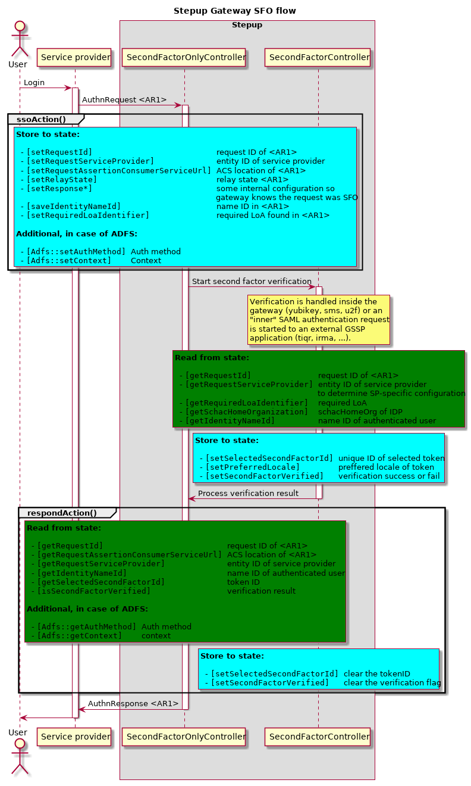
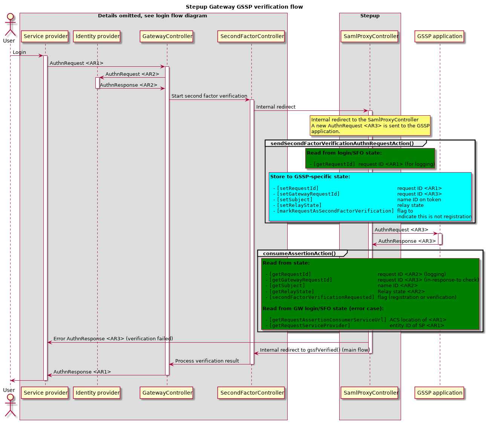
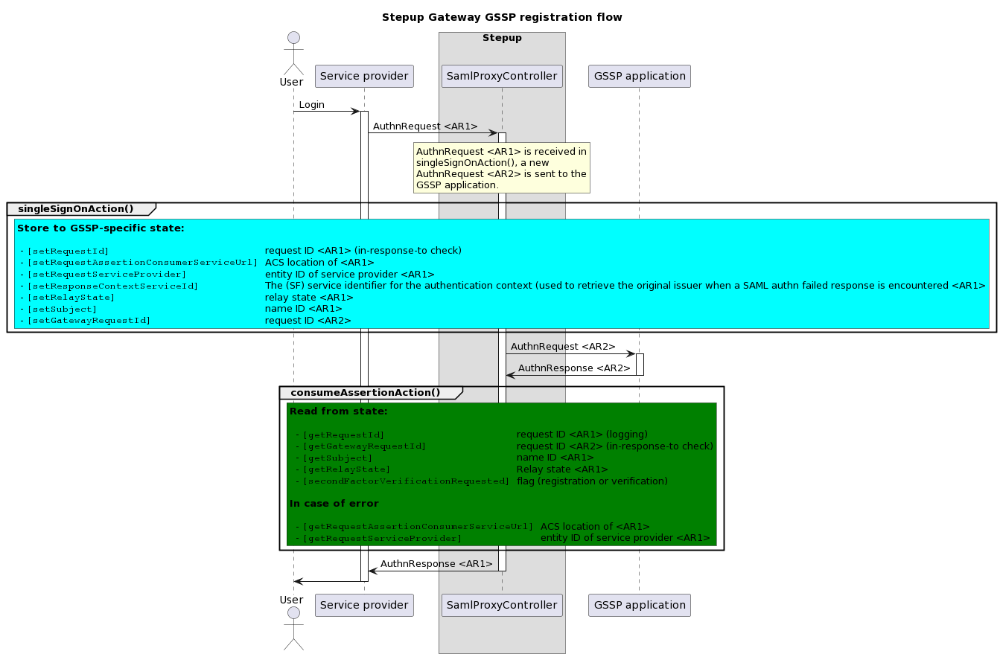

# How Gateway handles state

When gateway handles a request, some information about that request is
stored in the session data of the user. This document describes the
various flows within Stepup, in what parts of the code the flows are
implemented and what the implementation stores and reads from the user
session.

## Gateway login flow

<!---
regenerate this diagram with `plantuml GatewayState.md` or with http://www.plantuml.com/plantuml
@startuml diagrams/gateway-state-login-flow.png

title Stepup Gateway login flow
actor User

participant "Service provider" as SP
participant "Identity provider" as IDP
box "Stepup"
    participant "GatewayController" as GW
    participant "SecondFactorController" as SF
end box

User -> SP: Login
activate SP

    SP -> GW: AuthnRequest <AR1>
    activate GW

        group ssoAction()
            rnote over GW #aqua
            **Store to state:**

              - ""[setRequestId]                          ""request ID of <AR1>
              - ""[setRequestServiceProvider]             ""entity ID of service provider
              - ""[setRequestAssertionConsumerServiceUrl] ""ACS location of <AR1>
              - ""[setRelayState]                         ""relay state <AR1>
              - ""[setResponse*]                          ""some internal configuration
                ""                                        ""so gateway knows the request
                ""                                        ""was not SFO or GSSP
              - ""[setRequiredLoaIdentifier]              ""required LoA found in <AR1>
              - ""[setGatewayRequestId]                   ""request ID of <AR2>
            end note
        end

        GW -> IDP: AuthnRequest <AR2>
        activate IDP
            IDP -> GW: AuthnResponse <AR2>
        deactivate IDP

        group consumeAssertionAction()
            rnote over GW #green
            **Read from state:**

              - ""[getRequestId]        ""request ID <AR1>
              - ""[getGatewayRequestId] ""request ID <AR2>

            **In case of error:**
              - ""[getRequestAssertionConsumerServiceUrl] ""ACS location of <AR1>
              - ""[getRequestId]                          ""request ID of <AR1>
            end note

            rnote over GW #aqua
            **Store to state:**

              - ""[saveAssertion]            ""the assertion in response to <AR2>
              - ""[setSchacHomeOrganization] ""schacHomeOrg of IDP
              - ""[saveIdentityNameId]       ""name ID of authenticated user
              - ""[setAuthenticatingIdp]     ""entity ID of the IDP
            end note
        end

        GW -> SF: Start second factor verification
        activate SF
            rnote over SF
                Verification is handled inside the
                gateway (yubikey, sms) or an
                "inner" SAML authentication request
                is started to an external GSSP
                application (tiqr, irma, ...).
            end note
            rnote over SF #green
            **Read from state:**

              - ""[getRequestId]              ""request ID of <AR1>
              - ""[getRequestServiceProvider] ""entity ID of service provider
                ""                            ""to determine SP-specific configuration
              - ""[getRequiredLoaIdentifier]  ""required LoA
              - ""[getSchacHomeOrganization]  ""schacHomeOrg of IDP
              - ""[getIdentityNameId]         ""name ID of authenticated user
            end note

            rnote over SF #aqua
            **Store to state:**

              - ""[setSelectedSecondFactorId] ""unique ID of selected token
              - ""[setPreferredLocale]        ""preffered locale of token
              - ""[setSecondFactorVerified]   ""verification success or fail
            end note

            SF -> GW: Process verification result
        deactivate SF

        group respondAction()
            rnote over GW #green
            **Read from state:**

              - ""[getRequestId]                          ""request ID of <AR1>
              - ""[getRequestAssertionConsumerServiceUrl] ""ACS location of <AR1>
              - ""[getRequestServiceProvider]             ""entity ID of service provider
              - ""[getAssertion]                          ""assertion in response to <AR2>
                ""                                        ""used to generate response to <AR1>
              - ""[getSelectedSecondFactorId]             ""token ID
              - ""[isSecondFactorVerified]                ""verification result
            end note

            rnote over SF #aqua
            **Store to state:**

              - ""[setSelectedSecondFactorId] ""clear the tokenID
              - ""[setSecondFactorVerified]   ""clear the verification flag
            end note

        end

        GW -> SP: AuthnResponse <AR1>
    deactivate GW

    SP -> User
deactivate SP

@enduml
--->

## Gateway SFO flow

<!---
regenerate this diagram with `plantuml GatewayState.md` or with http://www.plantuml.com/plantuml
@startuml diagrams/gateway-state-sfo-flow.png

title Stepup Gateway SFO flow
actor User

participant "Service provider" as SP
box "Stepup"
    participant "SecondFactorOnlyController" as SFO
    participant "SecondFactorController" as SF
end box

User -> SP: Login
activate SP

    SP -> SFO: AuthnRequest <AR1>
    activate SFO

        group ssoAction()
            rnote over SFO #aqua
            **Store to state:**

              - ""[setRequestId]                          ""request ID of <AR1>
              - ""[setRequestServiceProvider]             ""entity ID of service provider
              - ""[setRequestAssertionConsumerServiceUrl] ""ACS location of <AR1>
              - ""[setRelayState]                         ""relay state <AR1>
              - ""[setResponse*]                          ""some internal configuration so 
                ""                                        ""gateway knows the request was SFO
              - ""[saveIdentityNameId]                    ""name ID in <AR1>
              - ""[setRequiredLoaIdentifier]              ""required LoA found in <AR1>

            **Additional, in case of ADFS:**

              - ""[Adfs::setAuthMethod] ""Auth method
              - ""[Adfs::setContext]    ""Context
            end note
        end

        SFO -> SF: Start second factor verification
        activate SF

            rnote over SF
            Verification is handled inside the
            gateway (yubikey, sms) or an
            "inner" SAML authentication request
            is started to an external GSSP
            application (tiqr, irma, ...).
            end note

            rnote over SF #green
            **Read from state:**

              - ""[getRequestId]              ""request ID of <AR1>
              - ""[getRequestServiceProvider] ""entity ID of service provider
                ""                            ""to determine SP-specific configuration
              - ""[getRequiredLoaIdentifier]  ""required LoA
              - ""[getSchacHomeOrganization]  ""schacHomeOrg of IDP
              - ""[getIdentityNameId]         ""name ID of authenticated user
            end note

            rnote over SF #aqua
            **Store to state:**

              - ""[setSelectedSecondFactorId] ""unique ID of selected token
              - ""[setPreferredLocale]        ""preffered locale of token
              - ""[setSecondFactorVerified]   ""verification success or fail
            end note

            SF -> SFO: Process verification result
        deactivate SF

        group respondAction()
            rnote over SFO #green
            **Read from state:**

              - ""[getRequestId]                          ""request ID of <AR1>
              - ""[getRequestAssertionConsumerServiceUrl] ""ACS location of <AR1>
              - ""[getRequestServiceProvider]             ""entity ID of service provider
              - ""[getIdentityNameId]                     ""name ID of authenticated user
              - ""[getSelectedSecondFactorId]             ""token ID
              - ""[isSecondFactorVerified]                ""verification result

            **Additional, in case of ADFS:**

              - ""[Adfs::getAuthMethod] ""Auth method
              - ""[Adfs::getContext]    ""context
            end note

            rnote over SF #aqua
            **Store to state:**

              - ""[setSelectedSecondFactorId] ""clear the tokenID
              - ""[setSecondFactorVerified]   ""clear the verification flag
            end note
        end

        SFO -> SP: AuthnResponse <AR1>
    deactivate SFO

    SP -> User
deactivate SP

@enduml
--->

## Gateway GSSP verification flow

This flow happens when a user is asked to verify his second factor token,
the service provider in this diagram can be any (external) service provider,
or SelfService when the "Test a token" button is used.

<!---
regenerate this diagram with `plantuml GatewayState.md` or with http://www.plantuml.com/plantuml
@startuml diagrams/gateway-state-gssp-verification-flow.png

title Stepup Gateway GSSP verification flow
actor User

box "Details omitted, see login flow diagram"
    participant "Service provider" as SP
    participant "Identity provider" as IDP
    participant "GatewayController" as GW
    participant "SecondFactorController" as SF
end box
box "Stepup"
    participant "SamlProxyController" as PROXY
end box
participant "GSSP application" as GSSP

User -> SP: Login
activate SP

    SP -> GW: AuthnRequest <AR1>
    activate GW

        GW -> IDP: AuthnRequest <AR2>
        activate IDP
            IDP -> GW: AuthnResponse <AR2>
        deactivate IDP

        GW -> SF: Start second factor verification
        activate SF
            SF -> PROXY: Internal redirect
            activate PROXY
                rnote over PROXY
                Internal redirect to the SamlProxyController
                A new AuthnRequest <AR3> is sent to the GSSP
                application.
                end note

                group sendSecondFactorVerificationAuthnRequestAction()
                    rnote over PROXY #green
                    **Read from login/SFO state:**

                      - ""[getRequestId] ""request ID <AR1> (for logging)
                    end note

                    rnote over PROXY #aqua
                    **Store to GSSP-specific state:**

                      - ""[setRequestId]                          ""request ID <AR1>
                      - ""[setGatewayRequestId]                   ""request ID <AR3>
                      - ""[setSubject]                            ""name ID on token
                      - ""[setRelayState]                         ""relay state
                      - ""[markRequestAsSecondFactorVerification] ""flag to
                        ""                                        ""indicate this is not registration
                    end note
                end

                PROXY -> GSSP: AuthnRequest <AR3>

                activate GSSP
                    GSSP -> PROXY: AuthnResponse <AR3>
                deactivate GSSP

                group consumeAssertionAction()
                    rnote over PROXY #green
                    **Read from state:**

                      - ""[getRequestId]                      ""request ID <AR2> (logging)
                      - ""[getGatewayRequestId]               ""request ID <AR3> (in-response-to check)
                      - ""[getSubject]                        ""name ID <AR2>
                      - ""[getRelayState]                     ""Relay state <AR2>
                      - ""[secondFactorVerificationRequested] ""flag (registration or verification)

                    **Read from GW login/SFO state (error case):**

                      - ""[getRequestAssertionConsumerServiceUrl] ""ACS location of <AR1>
                      - ""[getRequestServiceProvider]             ""entity ID of SP <AR1>
                    end note
                end

                PROXY -> SP: Error AuthnResponse <AR3> (verification failed)
                PROXY -> SF: Internal redirect to gssfVerified() (main flow)
            deactivate PROXY

            SF -> GW: Process verification result
        deactivate SF

        GW -> SP: AuthnResponse <AR1>
    deactivate GW

    SP -> User
deactivate SP

@enduml
--->

## Gateway GSSP registration flow

This flow happens when users register their token in SelfService and when this token is
verified in RA. So the service provider in this diagram is always SelfService or RA.

<!---
regenerate this diagram with `plantuml GatewayState.md` or with http://www.plantuml.com/plantuml
@startuml diagrams/gateway-state-gssp-registration-flow.png

title Stepup Gateway GSSP registration flow
actor User

participant "Service provider" as SP
box "Stepup"
    participant "SamlProxyController" as PROXY
end box
participant "GSSP application" as GSSP

User -> SP: Login
activate SP

    SP -> PROXY: AuthnRequest <AR1>
    activate PROXY

        rnote over PROXY
        AuthnRequest <AR1> is received in
        singleSignOnAction(), a new
        AuthnRequest <AR2> is sent to the
        GSSP application.
        end note

        group singleSignOnAction()
            rnote over PROXY #aqua
            **Store to GSSP-specific state:**

             - ""[setRequestId]                          ""request ID <AR1> (in-response-to check)
             - ""[setRequestAssertionConsumerServiceUrl] ""ACS location of <AR1>
             - ""[setRequestServiceProvider]             ""entity ID of service provider <AR1>
             - ""[setRelayState]                         ""relay state <AR1>
             - ""[setSubject]                            ""name ID <AR1>
             - ""[setGatewayRequestId]                   ""request ID <AR2>
            end note
        end

        PROXY -> GSSP: AuthnRequest <AR2>

        activate GSSP
            GSSP -> PROXY: AuthnResponse <AR2>
        deactivate GSSP

        group consumeAssertionAction()
            rnote over PROXY #green
            **Read from state:**

              - ""[getRequestId]                      ""request ID <AR1> (logging)
              - ""[getGatewayRequestId]               ""request ID <AR2> (in-response-to check)
              - ""[getSubject]                        ""name ID <AR1>
              - ""[getRelayState]                     ""Relay state <AR1>
              - ""[secondFactorVerificationRequested] ""flag (registration or verification)

            **In case of error**

              - ""[getRequestAssertionConsumerServiceUrl] ""ACS location of <AR1>
              - ""[getRequestServiceProvider]             ""entity ID of service provider <AR1>
            end note
        end

        PROXY -> SP: AuthnResponse <AR1>
    deactivate PROXY

    SP -> User
deactivate SP

@enduml
--->
