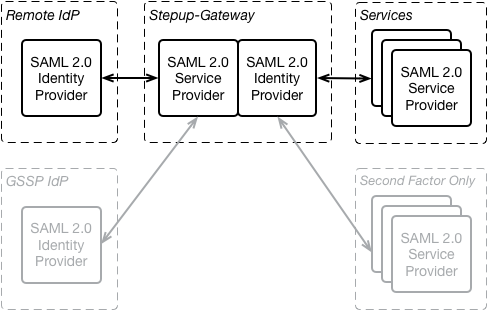

# SAML 2.0 Proxy

The Stepup-Gateway is a SAML 2.0 Proxy. This section describes the SAML Implementation of the Gateway.

.

* [Remote IdP](#remote-idp) - This is the SAML Identity Provider that provides the 1st factor authentication of the user. It is also the source of the attributes of the user.
* [Stepup-Gateway](#stepup-gateway) - This component is a SAML 2.0 Proxy. It acts as a SAML Service Provider to the Remote IdP and it acts as a SAML Identity provider to the SAML Service Providers.
* [Services](#services) - SAML 2.0 Services providers that use the Stepup-Gateway for authentication.

There are [Sample messages](ExampleSAMLMessages.md) of an authentication using the aboce three components.

The Stepup-Gateway also uses SAML 2.0 for two other interactions. These are described elsewhere:
- [Second factor only (SFO) SP](SFO.md) - allows a Service to query the second factory only without the gateway contacting the Remote IdP.
- [Generic SAML stepup provider (GSSP)](GSSP.md) - A SAML interface for adding second factor authentication services to the Stepup-Gateway.

## Remote IdP

The Remote IdP (i.e. not the local IdP that is part of the Stepup-Gateway) is the IdP that provides the 1st factor authentication of the user including the SAML attributes of the user. A common Remote IdP for use with is [OpenConext Engine Block](https://github.com/OpenConext/OpenConext-engineblock), using another IdP (proxy) should not be difficult. In this section we describe the configuration of the Remote IdP in the Stepup-Gateway and the interface between the Remote IdP and the Stepup-Gateway in more detail. Read below [how to configure OpenConext engine as a Remote IdP for Stepup](#configuring-openconext-engine-as-a-remote-idp-for-stepup)

### Configuration in the Stepup Gateway

The EntityID, SSO Location and the SAML signing key of the remote IdP must be set in the [parameters.yml](../config/legacy/parameters.yaml.dist) of the gateway. The Stepup-Gateway does not support importing or updating the remote IdP configuration from metadata published by the remote IdP. You must configure that by hand.

### SAML Interface

The Stepup-Gateway does publish basic SAML Metadata that can be used by the Remote IdP. Even though the AuthnRequests by the Stepup-Gateway are signed, its metadata currenly lacks the signing certificate in the SPSSODescriptor. The location of the metadata is: `https://gateway.tld/authentication/metadata`

The Stepup-Gateway uses the HTTP-Redirect binding to send the AuthnRequest to the Remote IdP. The AuthnRequest
is signed using SHA256 (`http://www.w3.org/2001/04/xmldsig-more#rsa-sha256`). The Remote IdP must use the HTTP-POST Binding to send its Response back to to the Stepup-Gateway. The Remote IdP must sign the Assertion in the Response using either:
- SHA-1 (`http://www.w3.org/2000/09/xmldsig#rsa-sha1`); or
- SHA256 (`http://www.w3.org/2001/04/xmldsig-more#rsa-sha256`)

The AssertionConsumerService location where the Remote IdP must post back the response is: `https://{{ gateway_vhost_name }}/authentication/consume-assertion`

The EntityID of the Stepup-Gateway is equal to its metadata location: `https://gateway.tld/authentication/metadata`

## Stepup-Gateway

The Stepup-Gateway acts as a proxy between the Remote IdP and the Service Provider (SP) requesting authentication.

The design choice that was made was to leave anything not having to do with step-up to the Remote IdP. This means that the Remote IdP is expected to handle things like:
- The attribute release policy (ARP)
- Generation of SP specific targeted IDs
- Authorization (what SP may a user login to)
- Consent processing

### AuthnRequest from the Stepup-Gateway to the Remote IdP

All the above functions require that the Remote IdP is aware of the SP that user is authenticating to. To send this information to the Remote IdP the Setpup-Gateway uses the `RequesterID` in the `Scoping` Element in the AuthnRequest.

Example of an AuthnRequest by the Stepup-Gateway in response to an AuthnRequest by an SP with EntityID `https://service-provider.example.org/authentication/metadata`. Note how the Remote IdP learns the EntityID of the SP from the `samlp:RequesterID` element.
```xml
<samlp:AuthnRequest xmlns:samlp="urn:oasis:names:tc:SAML:2.0:protocol"
                    xmlns:saml="urn:oasis:names:tc:SAML:2.0:assertion"
                    ID="_1b8f282a9c194b264ef68761171539380de78b45038f65b8609df868f55e"
                    Version="2.0"
                    IssueInstant="2015-04-17T13:57:52Z"
                    Destination="https://remote-idp.tld.nl/authentication/idp/single-sign-on"
                    AssertionConsumerServiceURL="https://gateway.tld/authentication/consume-assertion"
                    ProtocolBinding="urn:oasis:names:tc:SAML:2.0:bindings:HTTP-POST">
    <saml:Issuer>https://gateway.tld/authentication/metadata</saml:Issuer>
    <samlp:Scoping ProxyCount="10">
        <samlp:RequesterID>https://service-provider.example.org/authentication/metadata</samlp:RequesterID>
    </samlp:Scoping>
</samlp:AuthnRequest>
```

### Response from the Remote IdP to the Stepup-Gateway

After receiving the AuthnRequest it is up to the Remote IdP to authenticate the user and to send a SAML Response with a signed assertion back to the Stepup-Gateway.

Before sending on the Assertion to the SP, the Stepup-Gateway modifies it to target it to the SP and then (re)signs it so that to the SP it is the Stepup-Gateway that is the IdP. Before the Stepup-Gateway sends the SAML Response with the Assertion to the SP, it determines whether it needs to perform a 2nd factor authentication for the now know user.

#### Subject NameID

There is only one thing that the Stepup-Gateway must know for itself from the Remote IdP: the identity of the user that it is authenticating. This identifier must be the same each time the user authenticates to the Stepup-Gateway. For this the Setup-Gateway uses the NameID from the Subject element in the Assertion from the Remote IdP:

```xml
<saml:Assertion>
    ...
    <saml:Subject>
        <saml:NameID Format="urn:oasis:names:tc:SAML:1.1:nameid-format:unspecified">urn:collab:person:example.org:user_1234</saml:NameID>
      ...
    </saml:Subject>
    ...
</saml:Assertion>
```

The example above shows a NameID in the internal "CollabID" format of OpenConext engineblock. For the Stepup-Gateway the format of the NameID does not matter, as long as it is a string that uniquely identifies the user. If you want to use the NameID pattern filters in Second Factor Only you may consider using a structured NameID like OpenConext does.

> The Remote IdP MUST put the unique identifier of the user in the Subject NameID of the SAML Assertion

#### eduPersonTargetedID Attribute

To allow the Remote IdP to control the Subject NameID that is sent to the SP the Stepup-Gateway **copies** the NameID from the `urn:mace:dir:attribute-def:eduPersonTargetedID` attribute to the Subject NameID. This meand the the SP never sees the value that the Remote IdP sends in the Subject NameID.

An example of a eduPersonTargetedID Attribute in the AttributeStatement in an Assertion:
```xml
<saml:Assertion>
...
    <saml:AttributeStatement>
        <saml:Attribute Name="urn:mace:dir:attribute-def:eduPersonTargetedID"
                        NameFormat="urn:oasis:names:tc:SAML:2.0:attrname-format:uri">
            <saml:AttributeValue>
                <saml:NameID Format="urn:oasis:names:tc:SAML:2.0:nameid-format:persistent">312f052c6bb58269e80486602ded357a1f558c315e</saml:NameID>
            </saml:AttributeValue>
        </saml:Attribute>
        ...
    </saml:AttributeStatement>
</saml:Assertion>
```

> The Remote IdP MUST put the Subject NameID for the **SP** in the `urn:mace:dir:attribute-def:eduPersonTargetedID` Attribute in the SAML Assertion.

### Single Sign On

The Proxy does not implement Single Sign On (SSO). Each authentication request from a SP results in an authentication request to the Remote IdP. If authentication at a LoA > 1 is required the  user's second factor will always be queried.

#### Session information

The Stepup-Gateway does not proxy the Session information from the Remote IdP to the SP:
- There is no `SessionNotOnOrAfter` in the AuthnStatement
- There is No `SessionIdentifier` in the AuthnStatement

### SAML Errors

The result of a successfull authentication is a SAML Response, with an Assetion, and with a `StatusCode` with a value of `Success`.
```xml
<samlp:Response >
    <saml:Issuer>...</saml:Issuer>
    <samlp:Status>
        <samlp:StatusCode Value="urn:oasis:names:tc:SAML:2.0:status:Success" />
    </samlp:Status>
    <saml:Assertion>
       ...
    </saml:Assertion>
</samlp:Response>
```

To indicate a problem the Gateway, as IdP, can send a SAML response with an error status code back to the SP. Currently two situations result in a specific status code. Note how `StatusCode`s are nested in the message examples below. Future verions of the gateway may define additional status codes, and additional situations in which to emit a status code. The `StatusMessage` is optional and may, or may not, be present.

#### AuthnFailed

When the user cancels authentiation, either at the remote IdP or during authentication of their second factor, the Gateway sends a SAML Response back to the SP with a top-level status code of `urn:oasis:names:tc:SAML:2.0:status:Responder` and a second-level status code of `urn:oasis:names:tc:SAML:2.0:status:AuthnFailed`.

Example:
```xml
<samlp:Response xmlns:samlp="urn:oasis:names:tc:SAML:2.0:protocol"
                xmlns:saml="urn:oasis:names:tc:SAML:2.0:assertion"
                ID="_Yasz/Kubip05bTwe7hIWOc5As+NxwmEliPJ88nUQ"
                Version="2.0"
                IssueInstant="2015-05-12T12:17:38Z"
                Destination="https://your-sp.example.com/acs-location"
                InResponseTo="_6d93f735ccfb8d98454999b4016d515834211b0dde"
                >
    <saml:Issuer>https://gw.example.org/authentication/metadata</saml:Issuer>
    <samlp:Status>
        <samlp:StatusCode Value="urn:oasis:names:tc:SAML:2.0:status:Responder">
            <samlp:StatusCode Value="urn:oasis:names:tc:SAML:2.0:status:AuthnFailed" />
        </samlp:StatusCode>
        <samlp:StatusMessage>Authentication cancelled by user</samlp:StatusMessage>
    </samlp:Status>
</samlp:Response>
```

#### NoAuthnConext

When the user cannot be authenticated at the requested LoA, either because the user has no second factor, the requested authentication conext is unknown, or the user does not have a second factor that can meet the requested LoA, the Gateway sands a SAML Response back to the SP with a top-level status code of `urn:oasis:names:tc:SAML:2.0:status:Requester` and a second-level status code of `urn:oasis:names:tc:SAML:2.0:status:NoAuthnContext`.

Example:
```xml
<samlp:Response xmlns:samlp="urn:oasis:names:tc:SAML:2.0:protocol"
                xmlns:saml="urn:oasis:names:tc:SAML:2.0:assertion"
                ID="_Yasz/Kubip05bTwe7hIWOc5As+NxwmEliPJ88nUQ"
                Version="2.0"
                IssueInstant="2015-05-12T12:17:38Z"
                Destination="https://your-sp.example.com/acs-location"
                InResponseTo="_6d93f735ccfb8d98454999b4016d515834211b0dde"
                >
    <saml:Issuer>https://gw.example.org/authentication/metadata</saml:Issuer>
    <samlp:Status>
        <samlp:StatusCode Value="urn:oasis:names:tc:SAML:2.0:status:Requester">
            <samlp:StatusCode Value="urn:oasis:names:tc:SAML:2.0:status:NoAuthnContext" />
        </samlp:StatusCode>      
    </samlp:Status>
</samlp:Response>
```

## Services

A Service is a SAML 2.0 Service Provider

TODO: Describe what a SP can expect.
