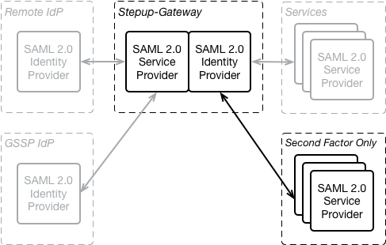

# Second Factor Only (SFO) Authentication

Second Factor Only (SFO) Authentication exposes the second factor authentication of the Stepup-Gateway directly to an SP, without first requiring a first actor authentication. I.e. when an Service Provider (SP) authenticated to the SFO endpoint of the Stepup-Gateway only the second facor is authenticated. This is different from the normal authentication offered by Stepup which always authenticates the first factor of the user by contacting the Remote IdP, before (optionally) authenticating the second factor.



Because for SFO the Stepup-Gateway does not do a first factor authentication, which would provide it with the unique identier of the user in Stepup, the SP has to provide this unique identifier in the authentication request to the Stepup-Gateway. For this the RequesterID element in the SAML AuthnRequest is used. This is similar to the method employed by [GSSP](GSSP.md), except that instead of an identifier for the second factor, the identifier of the user is passed in the AuthnRequest.

In the Stepup-Gateway on or more filters can be configured that limit the NameID's for which a specific SFO SP may request authentication. An SP, identified by it's EntityID, can use either the normal authentication endpoint or the SFO endpoint. It cannot use both.


## SAML AuthnRequest

To start a SFO the SP must send a SAML 2.0 `AuthnRequest` to the SFO endpoint of the Stepup-Gateway. This request must:

* use either the `urn:oasis:names:tc:SAML:2.0:bindings:HTTP-Redirect` binding or the `urn:oasis:names:tc:SAML:2.0:bindings:HTTP-POST`
* be signed using the `http://www.w3.org/2001/04/xmldsig-more#rsa-sha256` algorithm. Note the differences between the signing of `AuthnRequest` messages between the HTTP-Redirect and HTTP-POST bindings. The former encodes the signature in HTTP GET parameters, whereas the latter uses an XML-Signature in the SAML message itself. Please refer to [Bindings for the OASIS SecurityAssertion Markup Language (SAML)V2.0](https://docs.oasis-open.org/security/saml/v2.0/saml-bindings-2.0-os.pdf) sections 3.4 and 3.5 for more information.
* include a `RequestedAuthnContext` with the `AuthnContextClassRef` of the required SFO authentication level. The allowed values for AuthnContextClassRef are configured in the Stepup-Gateway and are typically different for each deployment.
* include the unique identifier of the user in the `Subject` element as a `NameID` (with `Format="urn:oasis:names:tc:SAML:1.1:nameid-format:unspecified",` see description of `AuthnRequest` in https://docs.oasis-open.org/security/saml/v2.0/saml-core-2.0-os.pdf, line 2001). This is the same identifier that was provided by the remote IdP when the user registered their second factor at the Stepup-SelfService interface.

SFO uses different SingleSignOn Location and `AuthnConext` identifiers as compared with standard authentication.

### Example AuthnRequest (HTTP-Redirect binding)

```xml
<samlp:AuthnRequest xmlns:samlp="urn:oasis:names:tc:SAML:2.0:protocol"
    xmlns:saml="urn:oasis:names:tc:SAML:2.0:assertion" ID="_zQIibz9FKixdlgX8E7bHqE29wfatcgbsPdVn0NN"
    Version="2.0" IssueInstant="2016-03-10T15:09:21Z"
    Destination="https://gw.stepup.example.org/gssp/2nd-factor-only/single-sign-on"
    AssertionConsumerServiceURL="https://application-gateway.some-organisation.example.org/consume-assertion"
    ProtocolBinding="urn:oasis:names:tc:SAML:2.0:bindings:HTTP-POST">
    <saml:Issuer>https://application-gateway.some-organisation.example.org/metadata</saml:Issuer>
    <saml:Subject>
        <saml:NameID Format="urn:oasis:names:tc:SAML:1.1:nameid-format:unspecified">urn:collab:person:some-organisation.example.org:m1234567890</saml:NameID>
    </saml:Subject>
    <samlp:RequestedAuthnContext>
        <saml:AuthnContextClassRef>http://stepup.example.org/assurance/sfo-level2</saml:AuthnContextClassRef>
    </samlp:RequestedAuthnContext>
</samlp:AuthnRequest>
```

Note that this message is signed, but that the signature is not visible in the XML message because it is encoded in the `HTTP GET parameters:

### Example AuthnRequest (HTTP-POST binding)

```xml
<samlp:AuthnRequest xmlns:samlp="urn:oasis:names:tc:SAML:2.0:protocol"
    xmlns:saml="urn:oasis:names:tc:SAML:2.0:assertion" ID="_zQIibz9FKixdlgX8E7bHqE29wfatcgbsPdVn0NN"
    Version="2.0" IssueInstant="2016-03-10T15:09:21Z"
    Destination="https://gw.stepup.example.org/gssp/2nd-factor-only/single-sign-on"
    AssertionConsumerServiceURL="https://application-gateway.some-organisation.example.org/consume-assertion"
    ProtocolBinding="urn:oasis:names:tc:SAML:2.0:bindings:HTTP-POST">
    <saml:Issuer>https://application-gateway.some-organisation.example.org/metadata</saml:Issuer>
    <ds:Signature xmlns:ds="http://www.w3.org/2000/09/xmldsig#">
        <ds:SignedInfo>
            <ds:CanonicalizationMethod Algorithm="http://www.w3.org/2001/10/xml-exc-c14n#" />
            <ds:SignatureMethod Algorithm="http://www.w3.org/2001/04/xmldsig-more#rsa-sha256" />
            <ds:Reference URI="#_zQIibz9FKixdlgX8E7bHqE29wfatcgbsPdVn0NN">
                <ds:Transforms>
                    <ds:Transform Algorithm="http://www.w3.org/2000/09/xmldsig#enveloped-signature" />
                    <ds:Transform Algorithm="http://www.w3.org/2001/10/xml-exc-c14n#" />
                </ds:Transforms>
                <ds:DigestMethod Algorithm="http://www.w3.org/2001/04/xmlenc#sha256" />
                <ds:DigestValue>BWoX/gcxNhcGks9M22fQxljmyUEMYPE4kGRDzRwACjw=</ds:DigestValue>
            </ds:Reference>
        </ds:SignedInfo>
        <ds:SignatureValue>yWdz0a8...btIbz19Q==</ds:SignatureValue>
        <ds:KeyInfo>
            <ds:X509Data>
                <ds:X509Certificate>MIIDlDCCAnw...3IZkkw=</ds:X509Certificate>
            </ds:X509Data>
        </ds:KeyInfo>
    </ds:Signature>
    <saml:Subject>
        <saml:NameID Format="urn:oasis:names:tc:SAML:1.1:nameid-format:unspecified">urn:collab:person:some-organisation.example.org:m1234567890</saml:NameID>
    </saml:Subject>
    <samlp:RequestedAuthnContext>
        <saml:AuthnContextClassRef>http://stepup.example.org/assurance/sfo-level2</saml:AuthnContextClassRef>
    </samlp:RequestedAuthnContext>
</samlp:AuthnRequest>
```

## SAML Response

The result of a successful authentication is a SAML `Response`:
* This response does not contain an `AttributeStatement`
* It could contain a different `AuthnContextClassRef` than requested. If it does this must always be a higher level

When a user cannot be authenticated, the Stepup-gateway returns a SAML Response to the SP with a non
success status:
* `urn:oasis:names:tc:SAML:2.0:status:Responder` with subcode `urn:oasis:names:tc:SAML:2.0:status:AuthnFailed` Authentication not successful
* `urn:oasis:names:tc:SAML:2.0:status:Responder` with subcode `urn:oasis:names:tc:SAML:2.0:status:NoAuthnContext` The user could not be authenticated at the requested level

### Example Response (success)

```xml
<samlp:Response xmlns:samlp="urn:oasis:names:tc:SAML:2.0:protocol"
                xmlns:saml="urn:oasis:names:tc:SAML:2.0:assertion"
                ID="_ECAokbn0lm7lfVT7THQUl+dSbMrpeyAgiTv0+q16"
                Version="2.0"
                IssueInstant="2016-03-10T15:09:25Z"
                Destination="https://application-gateway.some-organisation.example.org/consume-assertion"
                InResponseTo="_zQIibz9FKixdlgX8E7bHqE29wfatcgbsPdVn0NN"
                >
    <saml:Issuer>https://gw.stepup.example.org/second-factory-only/metadata</saml:Issuer>
    <samlp:Status>
        <samlp:StatusCode Value="urn:oasis:names:tc:SAML:2.0:status:Success" />
    </samlp:Status>
    <saml:Assertion xmlns:xsi="http://www.w3.org/2001/XMLSchema-instance" 
        xmlns:xs="http://www.w3.org/2001/XMLSchema" ID="_zQIibz9FKixdlgX8E7bHqE29wfatcgbsPdVn0NN"
        Version="2.0" IssueInstant="2016-03-10T15:09:25Z">
        <saml:Issuer>https://gw.stepup.example.org/second-factory-only/metadata</saml:Issuer>
        <ds:Signature xmlns:ds="http://www.w3.org/2000/09/xmldsig#">
            <ds:SignedInfo>
                <ds:CanonicalizationMethod Algorithm="http://www.w3.org/2001/10/xml-exc-c14n#" />
                <ds:SignatureMethod Algorithm="http://www.w3.org/2001/04/xmldsig-more#rsa-sha256" />
                <ds:Reference URI="#_1ROuxGVzJi5bbre6W4woNza82aK41HKjp6aKtw9r">
                    <ds:Transforms>
                        <ds:Transform Algorithm="http://www.w3.org/2000/09/xmldsig#enveloped-signature" />
                        <ds:Transform Algorithm="http://www.w3.org/2001/10/xml-exc-c14n#" />
                    </ds:Transforms>
                    <ds:DigestMethod Algorithm="http://www.w3.org/2001/04/xmlenc#sha256" />
                    <ds:DigestValue>YR5JFfJc1JZIKm7Ao3kXtDupEfeMrhKpD9T1lF1z0Lg=</ds:DigestValue>
                </ds:Reference>
            </ds:SignedInfo>
            <ds:SignatureValue>...</ds:SignatureValue>
            <ds:KeyInfo>
                <ds:X509Data>
                    <ds:X509Certificate>...</ds:X509Certificate>
                </ds:X509Data>
            </ds:KeyInfo>
        </ds:Signature>
        <saml:Subject>
            <saml:NameID Format="urn:oasis:names:tc:SAML:1.1:nameid-format:unspecified">urn:collab:person:some-organisation.example.org:m1234567890</saml:NameID>
            <saml:SubjectConfirmation Method="urn:oasis:names:tc:SAML:2.0:cm:bearer">
                <saml:SubjectConfirmationData NotOnOrAfter="2016-03-10T15:14:25Z"
                    Recipient="https://application-gateway.some-organisation.example.org/consume-assertion"
                    InResponseTo="_zQIibz9FKixdlgX8E7bHqE29wfatcgbsPdVn0NN" />
            </saml:SubjectConfirmation>
        </saml:Subject>
        <saml:Conditions NotBefore="2016-03-10T15:09:25Z" NotOnOrAfter="2016-03-10T15:14:25Z">
            <saml:AudienceRestriction>
                <saml:Audience>https://application-gateway.some-organisation.example.org/metadata</saml:Audience>
            </saml:AudienceRestriction>
        </saml:Conditions>
        <saml:AuthnStatement AuthnInstant="2016-03-10T15:09:25Z">
            <saml:AuthnContext>
                <saml:AuthnContextClassRef>http://stepup.example.org/assurance/sfo-level3</saml:AuthnContextClassRef>
            </saml:AuthnContext>
        </saml:AuthnStatement>
    </saml:Assertion>
</samlp:Response>
```

### Example Response (error)

```xml
<samlp:Response xmlns:samlp="urn:oasis:names:tc:SAML:2.0:protocol"
    xmlns:saml="urn:oasis:names:tc:SAML:2.0:assertion"
    ID="_Yasz/Kubip05bTwe7hIWOc5As+NxwmEliPJ88nUQ" Version="2.0" IssueInstant="2016-03-10T15:09:25Z"
    Destination="https://application-gateway.some-organisation.example.org/consume-assertion"
    InResponseTo="_zQIibz9FKixdlgX8E7bHqE29wfatcgbsPdVn0NN"
                >
    <saml:Issuer>https://gw.stepup.example.org/second-factory-only/metadata</saml:Issuer>
    <samlp:Status>
        <samlp:StatusCode Value="urn:oasis:names:tc:SAML:2.0:status:Requester">
            <samlp:StatusCode Value="urn:oasis:names:tc:SAML:2.0:status:NoAuthnContext" />
        </samlp:StatusCode>      
    </samlp:Status>
</samlp:Response>
```

## ADFS MFA extension

To be able to support the ADFS MFA extension a variation on the `urn:oasis:names:tc:SAML:2.0:bindings:HTTP-POST` binding is implemented at the gateway. When both the `Context` and `AuthMethod` HTTP POST parameters are present in addition to the `SAMLRequest` parameter defined by the binding the following ADFS specific behaviour is enabled:
* The SAML Response will be retured in a HTTP POST variable named `_SAMLResponse` instead of `SAMLResponse`.
* The `Context` and `AuthMethod` HTTP POST variables that we received with the SAML Request are returned with the response
* The destination to which the response is POSTed (i.e. the Assertion Consumer Service location) is not matched against the registered ACS locations

# Security

## The SP must do a first factor authentication before starting a SFO authentication

Starting an SFO authentication will immediately start an authentication at the SURFconext Strong Authentication gateway. This means that a push notification (Tiqr) or an SMS can be sent to the user being authenticated depending on the available second factors for the user. If authentication
is started for the wrong user, this will derange the targeted user and in case of SMS, incur a cost to the institution and possibly to the user.

By observing the behavior of the SFO authentication it is possible to determine whether a user identifier exists and what second factor types are avaiable to a user.

For this reasons a SP must do a first factor authentication before starting a SFO authentication.

In the Stepup-Gateway on or more filters can be configured that limit the NameID's for which a specific SFO SP may request authentication.