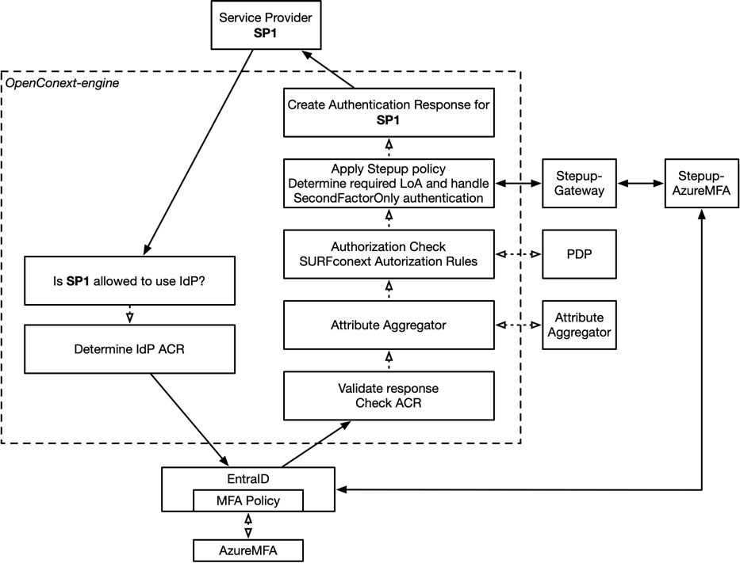

# RFC Using AzureMFA without prior registration in OpenConext

Institutions want all their users to use MFA, this includes large groups like students.
These groups often already have a Microsoft MFA (AzureMFA) enrolled because they are using Office 365 
and / or the Microsoft Exchange mail though the institutions Azure tenant.
Because the additional identity validation - with the associated higher level of assurance (LoA) - is typically 
deemed unnecessary for the kinds of applications that students access, the institutions want to reuse the 
existing AzureMFA in OpenConext with the MFA (Stepup) policies that are in OpenConext.
Currently there are limitations in the MFA policies that can be set in both EntraID and OpenConext when AzureMFA
is used as the MFA method without going though the OpenConext-Stepup (self-service) registration process.

This RFC proposes a solution to this problem by allowing institutions to use the full OpenConext Stepup policies
for all their users that have AzureMFA, without requiring users to register their AzureMFA in OpenConext Stepup.
An unregistered AzureMFA will be valued as LoA 1.5 in OpenConext, which is the same LoA that the
self-asserted tokens in OpenConext Stepup get. This allows institutions to use the full range of LoAs
and policies in OpenConext Stepup for their users, while minimizing the burden on users and institution 
support by dropping the requirement that they register their AzureMFA before use.

## Background
In Stepup users can register their Microsoft MFA using the Stepup-AzureMFA GSSP. 
This is a good option if additional identity validation is required.
If no additional validation is required, self asserted tokens could be used, but that is extra work for the
user that adds little extra assurance.

Another option for the institution is to set an access policy on their EntraID IdP that requires MFA for this group
(e.g. students) but not others when authenticating to OpenConext engine.
The policy in EntraID does allow setting exclusions based on IP address, which is important to exclude exam 
locations.

The EntraID policy is limited to OpenConext engine as SAML SP (RP) in EntraID as a whole, 
EntraID cannot act on the Context in the SAML AuthnRequest, specifically the RequesterID that is in the 
Scoping element of the SAML AuthnRequest and that contains the entityID of the SP that is requesting the authentication.
This means that all SAML SPs and OpenIDConnext RPs that the institution uses through OpenConext engine must share 
the same policy. 

This becomes a limitation when:
- The institution wants to exclude certain SAML SPs or OpenIDConnect RPs from the MFA requirement in EntraID.
- The institution want to use the AuthnRequestContext in the SAML AuthnRequest require MFA, because this will
  trigger MFA for any user in EntraID, nut just for the users that are in the group that is required to use AzureMFA.

The situation is very similar for institutions that are using Microsoft ADFS as their IdP because ADFS, like EntraID,
does not allow to set policies based on the RequesterID in the SAML AuthnRequest.

See the following diagram for an overview of the current situation:

* The EntraID MFA policy does not allow the RequestorID to be used as a condition for the policy.
* Signalling MFA from OpenConext-engine to EntraID is possible, but is of very limited use because
  at that point the user is not yet authenticated so the user's attributes and any attributes
  from the attribute aggregator are not available to make the MFA policy decision.

This makes the possible stepup (MFA) policy options in EntraID and ADFS when used with AzureMFA
via OpenConext quite limited in practice.

 ## Proposed solution
We want to allow institutions to use the full OpenConext Stepup policies for users that have AzureMFA, without 
requiring users to register their AzureMFA in OpenConext Stepup.

We want to leverage the existing Stepup functionality in OpenConext-engine and the existing AzureMFA GSSP
in OpenConext Stepup. If a user does not have a active token in OpenConext Stepup, the Stepup_gateway
will redirect the user to the AzureMFA GSSP for authentication directly.
The user is not provisioned in OpenConext Stepup.
The user id that is used for the authentication in AzureMFA is the email address of the user that
OpenConext engine has received from the IdP. 
This functionality can be enabled on a per institution basis though the institution-configuration in middleware
This means that the IdP must send the UPN of the user to OpenConext engine, which is commonly the case for 
Microsoft IdPs.
The Stepup-Gateway needs to be given the AzureMFA fallback GSSP configuration 

Implementing this solution requires changes to:
- OpenConext-engine to send the email address of the user to the Stepup_gateway in the SAML AuthnRequest.
- OpenConext-gateway
  - to check if the AzureMFA fallback is enabled for the institution based on the institution id that is part 
    of the Subject in the SAML AuthnRequest from OpenConext-engine.
  - to check if the user has an active token in OpenConext Stepup
  - to accept the email address of the user in the SAML AuthnRequest and send it as the user id
  for the authentication to the AzureMFA GSSP.
  - to know which GSSP to use for the AzureMFA fallback authentication flow.
- Stepup-AzureMFA GSSP
  - to accept the email address of the user from the SAML AuthnRequest from the OpenConext-gateway
  - to use the email address of the user as the user id for the authentication to AzureMFA
- Stepup-middleware
  - To allow the AzureMFA fallback to be enabled in the institution-configuration
  - To push the AzureMFA fallback configuration to the OpenConext-gateway database
  - To allow the Stepup-RA to retrieve this configuration for display to the RAA
- Stepup-RA
  - To show the AzureMFA fallback configuration in the Stepup-RA in the institution configuration that 
    is visible to RAA's

# Implementation details and discussion

## Naming
The name "AzureMFA fallback" is used in this RFC to indicate that the AzureMFA GSSP is used as a fallback
The feauture is not limited to AzureMFA, but can be used with any GSSP that accepts an email address as the user id.
We need to think of a better, more generic name for this feature.
- Registration bypass / fallback?
- GSSP fallback?

## OpenConext-engine

### SAML AuthnRequest extension
The OpenConext-engine will need to be modified to send the email address of the user to the Stepup-Gateway
during the Second Factor Only authentication.
We cannot use the Subject element in the SAML AuthnRequest to send the email address of the user, 
because this is already used to send the urn:collab ID of the user.
This is done by adding the email address as in a SAML extension. 
A similar extension is already implemented in the Stepup-SAML-Bundle and is used between Stepup-Gateway
and AzureMFA GSSP: https://github.com/OpenConext/Stepup-saml-bundle/blob/main/src/SAML2/Extensions/GsspUserAttributesChunk.php
This uses the urn:mace:surf.nl:stepup:gssp-extensions namespace to add a "UserAttributes" extension.
Engine does not user the Stepup-SAML-Bundle, but it does use the same SSP SAML2 library.
The "GSSP" in the namespace is a bit misleading, because the extension is not specific to GSSP's.
I like the idea of having a UserAttributes extension, because it is a generic extension that can be used to
transfer other user attributes besides the email address as well.
An option would be to send the institution id (schacHomeOrganization) in this way instead of decoding it from the
Subject in the SAML AuthnRequest. Probably not a good idea, because the institution id is already in the Subject and
we probably already get the institution id from the IdP in the SAML response for other purposes.

### OpenConext-gateway

The AzureMFA fallback could be implemented for several of the authentication flows (see: https://github.com/OpenConext/Stepup-Gateway/blob/main/docs/SAMLProxy.md) 
that are supported by the Stepup-gateway:

1. Normal authentication flow SP -> Stepup-Gateway -> remote IdP (i.e. OpenConext-engine) -> Stepup-Gateway -> SP
2. Second Factor Only authentication flow
3. Second Factor Only authentication flow from the ADFS plugin

The normal authentication flow is very different from the other two flows because Stepup-gateway receives 
a SAML response from the remote IdP (i.e. OpenConext-engine) and thus has the user attributes from the IdP
(including the email address) available in the SAML response.
Although it is possible to implement the AzureMFA fallback in this flow, and there might be use cases for it,
it is not the main use case for this RFC.

The ADFS plugin is a special case, and implies that the user is doing MFA on ADFS. 
That makes it not applicable for this RFC.

This means that the AzureMFA fallback will be implemented for the Second Factor Only authentication flow (#2) 
only.

#### Authentication logic
1. Check if the user has an active token in OpenConext Stepup - this is already implemented as part of the
   normal authentication flow.
   If the user has an active token, continue with the normal authentication flow.
2. Check if we have a fallback GSSP configured in the Stepup-gateway configuration.
   If we do not have a fallback GSSP configured, continue with the normal authentication flow.
3. Check if we are in the Second Factor Only authentication flow.
   If we are not in the Second Factor Only authentication flow, continue with the normal authentication flow.
4. Check if the SAML extension with the email address is present in the SAML AuthnRequest.
   It is not an error if it is not present, handle this case as if the azureMFA fallback is not enabled for the institution.
   This makes the implementation backwards compatible with the current situation.
5. Check if the AzureMFA fallback is enabled for the institution based on the institution id that is part 
   of the Subject in the SAML AuthnRequest from OpenConext-engine.
   If it is not enabled, continue with the normal authentication flow.

Now we know that:
- we have a fallback GSSP configured in the Stepup-gateway configuration
- the user does not have an active token in OpenConext Stepup
- we are in the Second Factor Only authentication flow
- the SAML extension with the email address is present in the SAML AuthnRequest
- the AzureMFA fallback is enabled for the institution

So we can continue with the AzureMFA fallback specific part of the authentication flow:
1. Send the SAML AuthnRequest to the AzureMFA GSSP with the email address of the user as the user id. 
   This is almost the same as the normal authentication flow, but the Subject element in the SAML AuthnRequest
   is different. 
   Here it is the email address of the user instead of AzureMFA TokenID.
   We need to remember this email address in the session, because we need to verify that it is in the Subject 
   in the SAML response next.
2. Receive the SAML response from the AzureMFA GSSP. Check that the Subject element in the SAML response
   contains the email address of the user that we sent in the SAML AuthnRequest.
   If it does not, we need to return an error.
   This step is similar to the normal authentication flow.

### Logging
Application log:
- Log that the AzureMFA fallback is used for the authentication.
- Log the email address of the user that is used for the authentication to AzureMFA.

Authentication log, only if the authentication is successful:
- Log that the AzureMFA fallback is used for the authentication.
- Log the email address of the user that is used for the authentication to AzureMFA.

## Stepup-AzureMFA GSSP
Currently AzureMFA TokenID looks like "abcdef-1234|user@example.org".
These ere generated by the AzureMFA GSSP during registration and are returned in the Subject in the SAML Response to the Stepup-gateway.
For an authentication the Stepup-Gateway sends this in the Subject SAML AuthnRequest to the GSSP.
See how GSSP Authentication and Enrollment work: https://github.com/OpenConext/Stepup-Gateway/blob/main/docs/GSSP.md#enrollment and https://github.com/OpenConext/Stepup-Gateway/blob/main/docs/GSSP.md#authentication

We can easily "fake" an AzureMFA registered token. e.g. adding "XXXXXX-XXXX|" in front of the email address creates
an valid Stepup-AzureMFA TokenID.
What we want to do is accept an normal email address, without the "abcdef-1234|"
This means that Stepup-Gateway does not need to send the arbitrary "abcdef-1234|" in the Subject.
This allows makes it easier for someone else to use another GSSP for the "AzureMFA" fallback, if they want to,
because any GSSP that accepts an email address as the user id can be used, and using the Subject
for this purpose in SAML is common practice.

So we need to change the Stepup-AzureMFA GSSP to accept an email address as the user id.

## Stepup-middleware
The Stepup-middleware will need to be modified to allow the AzureMFA fallback to be enabled in the
institution-configuration.
Add a per institution configuration option in the institution-configuration to enable/disable the fallback.
Default is disabled.
The configuration option must also be made available to the Stepup-gateway by writing it to a table
in the gateway database schema.
The configuration option must be made available to the Stepup-RA so that the RAA can see it in the
institution-configuration in the Stepup-RA.
Note the middleware writes to the gateway database schema, the gateway only reads from it.
The Doctrine migration for this change must be added to the Stepup-middleware repository.
The database schema changes must be backwards-compatible. I.e. they must not break with the current middleware and gateway 
versions, otherwise rolling upgrades will not work.
Likewise the middleware API changes between the middleware and the Stepup-RA should be backwards-compatible.
Creating a backwards-compatible Stepup-RA and releasing that first is an option.

## Stepup-RA
The Stepup-RA needs to be modified to show the fallback configuration in the institution configuration

# Testing strategy

Most changes are in Stepup-gateway and OpenConext-engine.

For OpenConext-engine, observations from the SAML AuthnRequest and SAML response can be used to test the changes.
Check that the SAML extension does not break the current version of the Stepup-Gateway. 
It shouldn't, it should ignore it. 

A challenge for testing AzureMFA is that it needs an Azure tenant for testing. 
The complexity of the AzureMFA GSSP is low and the changes are small.

## Integration tests

### Stepup
Integration tests for this feature can be added to: https://github.com/OpenConext/OpenConext-devconf/tree/main/stepup

This will allow us to test Stepup-gateway, Stepup-Middleware and Stepup-RA.
This will require two changes:
- The sp.php in https://github.com/OpenConext/OpenConext-devssp must be able to send SAML AuthnRequests with the email 
  address of the user in the SAML extension. That is sufficient for emulating tOpenConext-engine.
- The example-GSSP must accept an email address of the user in the SAML AuthnRequest as a valid authentication.

### OpenConext-engine

Engine has it's own tests.

### Unit tests / component tests

 Component level test for engine should be sufficient.
 Unit testing for SAML extension code, both for engine and Stepup-gateway (Stepup-SAML-Bundle).
 